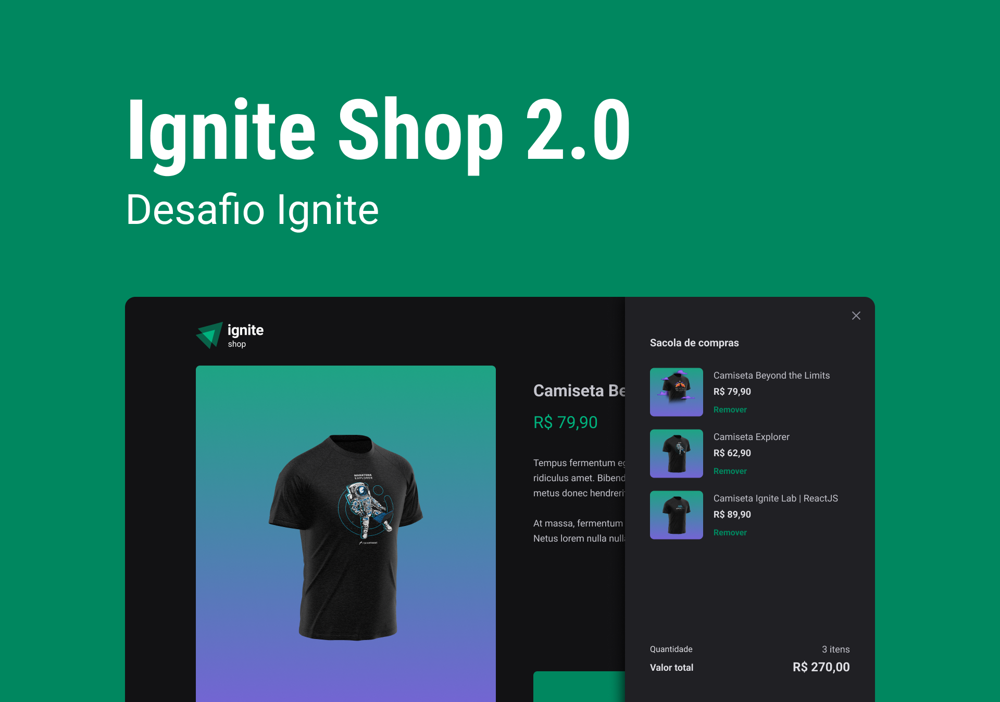

<div align="center" id="top"> 
  

  &#xa0;

  <!-- <a href="https://ignite-timer.netlify.com">Demo</a> -->
</div>

<h1 align="center">Ignite Shop</h1>


<!-- Status -->

<!-- <h4 align="center"> 
	🚧  Ignite Shop 🚀 Em construção...  🚧
</h4> 
<hr> -->

<p align="center">
  <a href="#dart-sobre">Sobre</a> &#xa0; | &#xa0; 
  <a href="#sparkles-funcionalidades">Funcionalidades</a> &#xa0; | &#xa0;
  <a href="#rocket-tecnologias">Tecnologias</a> &#xa0; | &#xa0;
  <a href="#white_check_mark-pré-requesitos">Pré requisitos</a> &#xa0; | &#xa0;
  <a href="#checkered_flag-começando">Começando</a> &#xa0; | &#xa0;
  <a href="#memo-licença">Licença</a> &#xa0; | &#xa0;
  <a href="https://github.com/aleilson" target="_blank">Autor</a>
</p>

<br>

## :dart: Sobre ##

Ignite shop é uma vitrine virtual dos produtos cadastrados no Stripe com a funcionalidade de compra.

## :sparkles: Funcionalidades ##

:heavy_check_mark: Listagem de produtos cadastrado no Stripe.

:heavy_check_mark: Keen-slider para arrossel.

:heavy_check_mark: Stripe para pagamentos.

## :rocket: Tecnologias ##

As seguintes ferramentas foram usadas na construção do projeto:


- [Next.js](https://nextjs.org/)
- [TypeScript](https://www.typescriptlang.org/)
- [stitches/react](https://stitches.dev/)


## :white_check_mark: Pré requisitos ##

Antes de começar :checkered_flag:, você precisa ter o [Git](https://git-scm.com) e o [Node](https://nodejs.org/en/) instalados em sua maquina.

## :checkered_flag: Começando ##

```bash
# Clone este repositório
$ git clone https://github.com/aleilson/ignite-shop-nextjs
# Entre na pasta
$ cd ignite-shop-nextjs
# Instale as dependências
$ npm install
# Para iniciar o projeto
$ npm run dev
# O app vai inicializar em <http://localhost:3000>

# Chaves do Stripe a ser preenchidas no .env.local

# App
NEXT_URL=http://localhost:3000

# Stripe
STRIPE_PUBLICK_KEY=
STRIPE_SECRET_KEY=
```

## :memo: Licença ##

Este projeto está sob licença MIT. Veja o arquivo [LICENSE](LICENSE.md) para mais detalhes.


Feito com :heart: por <a href="https://github.com/aleilson" target="_blank">aleilson</a>

&#xa0;

<a href="#top">Voltar para o topo</a>